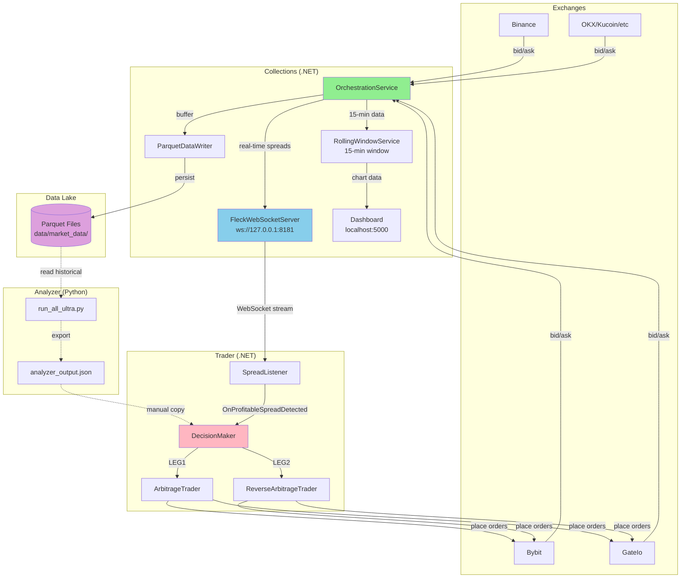
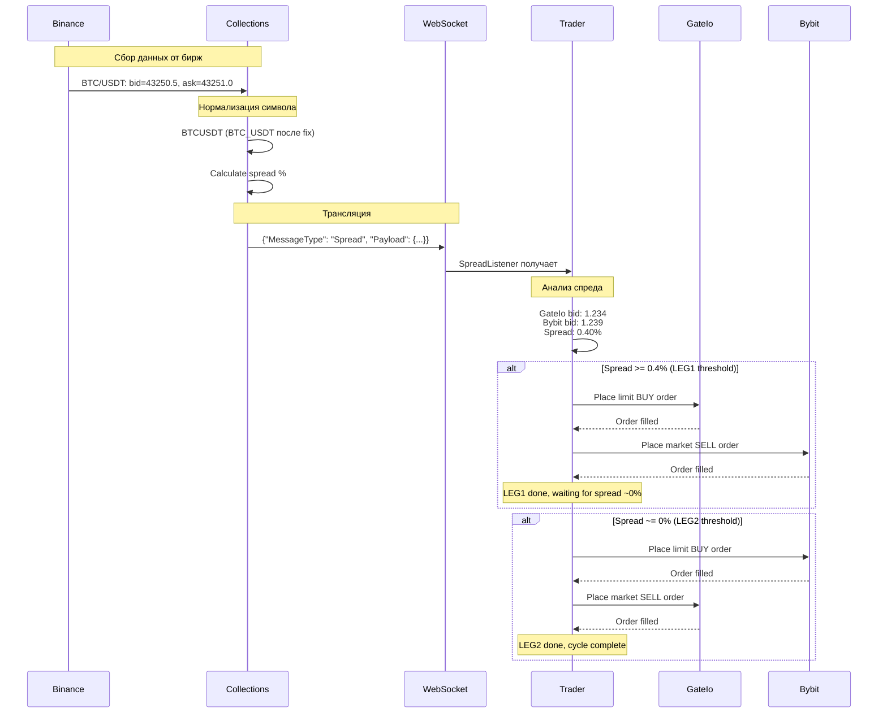
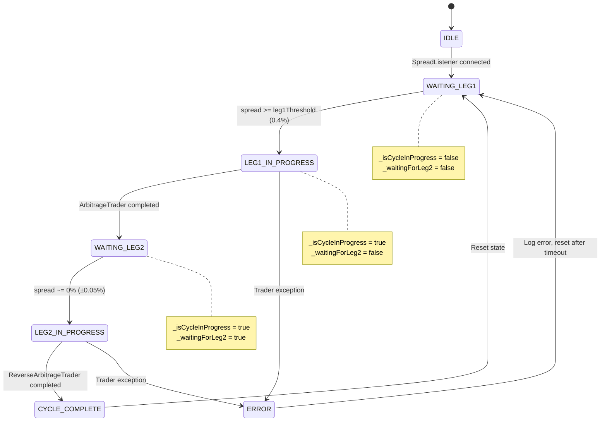
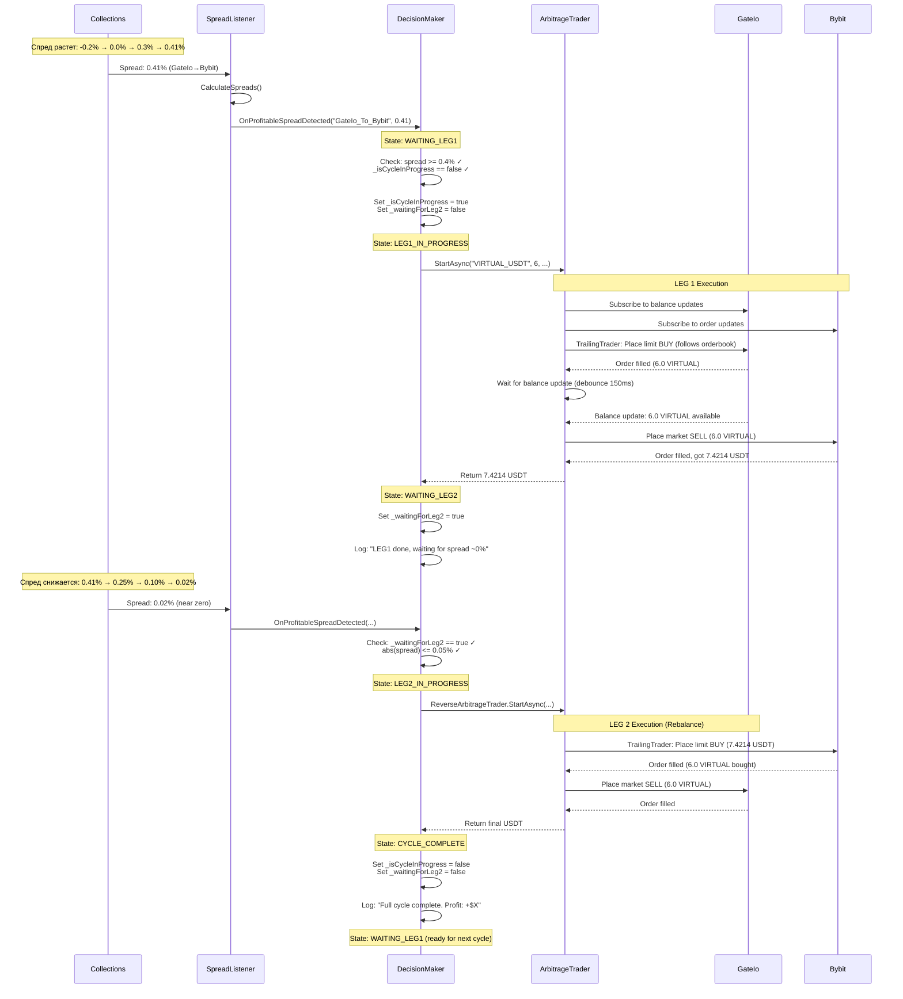
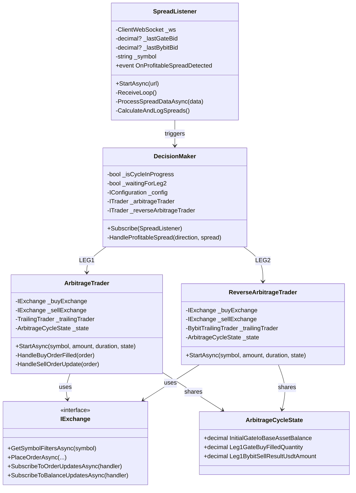
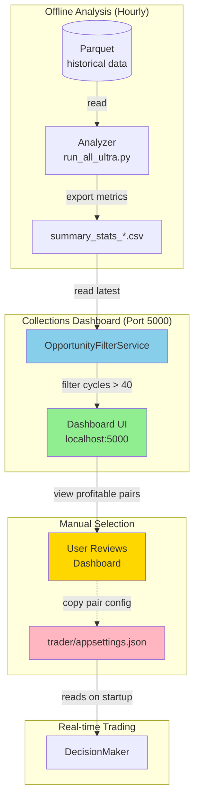

# Архитектура Системы (Визуализация)

**Дата:** 2025-11-10
**Навигация:** [← Текущее Состояние](01_current_state.md) | [Проблемы →](03_integration_problems.md) | [Roadmap →](04_implementation_roadmap.md)

---

## 1. Общая Архитектура Компонентов

---

## 2. Поток Данных (Real-time)

---

## 3. DecisionMaker State Machine

---

## 4. Торговый Цикл (Детальная Последовательность)

---

## 5. Ключевые Классы и Зависимости

---

## 6. Analyzer → Dashboard → Trader Integration Flow

---

**Следующий шаг:** [Посмотреть критичные проблемы интеграции →](03_integration_problems.md)
