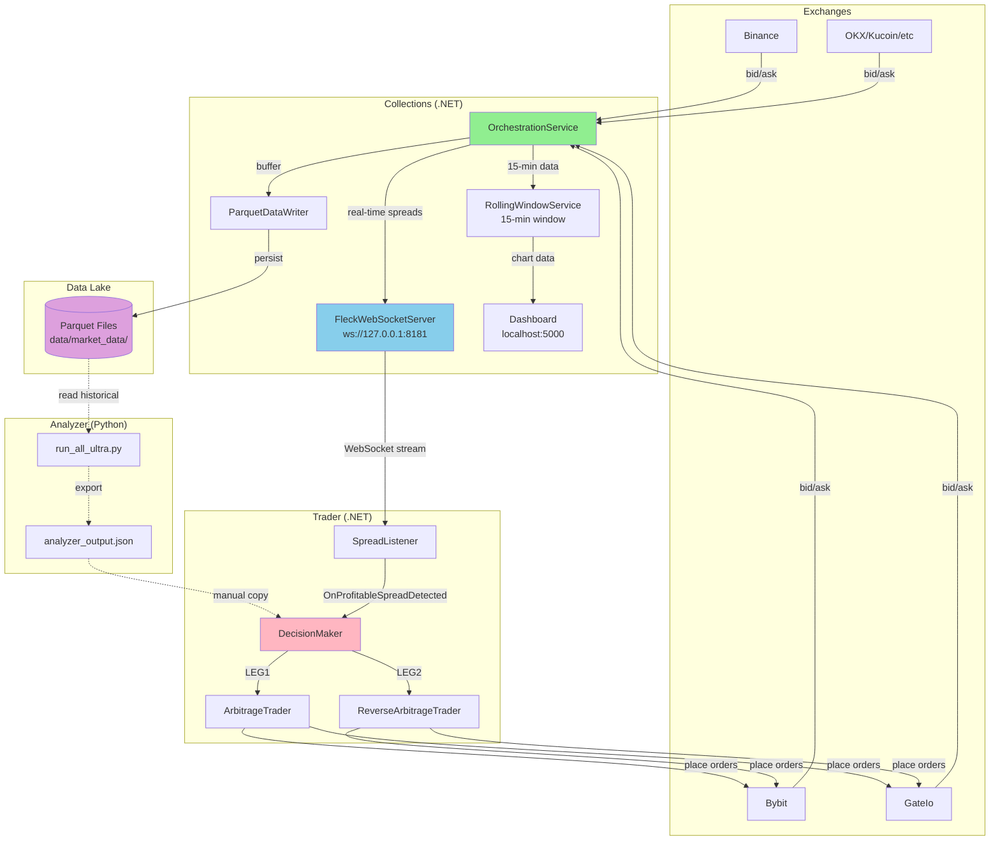
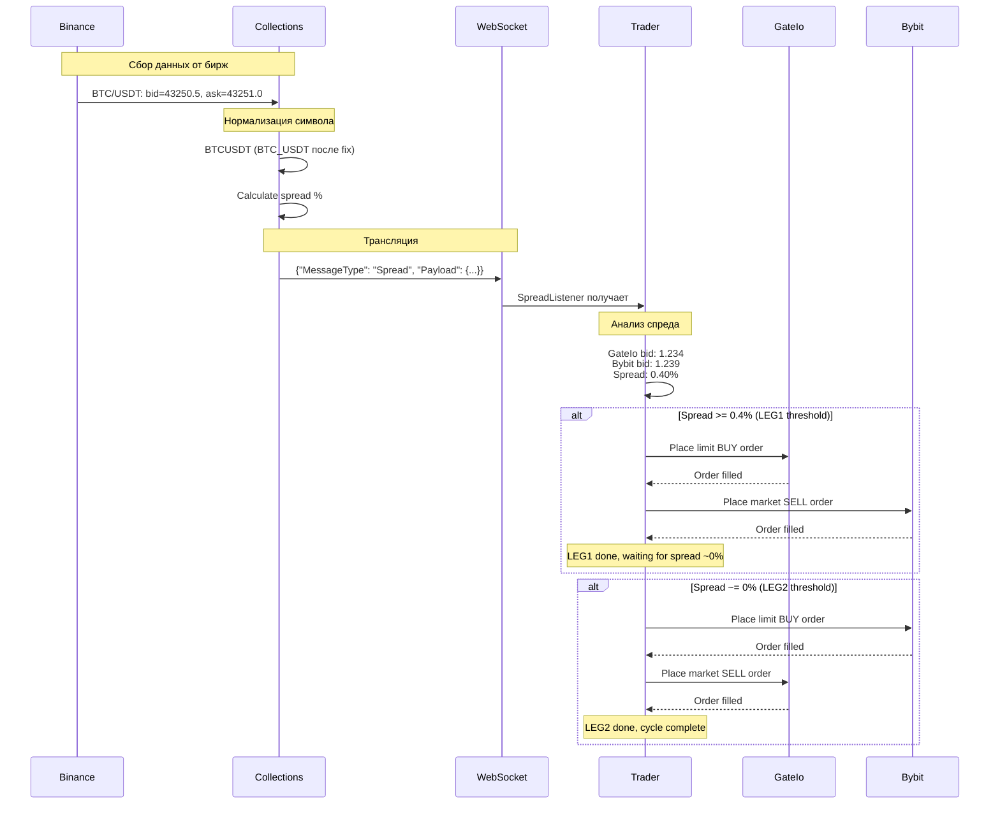
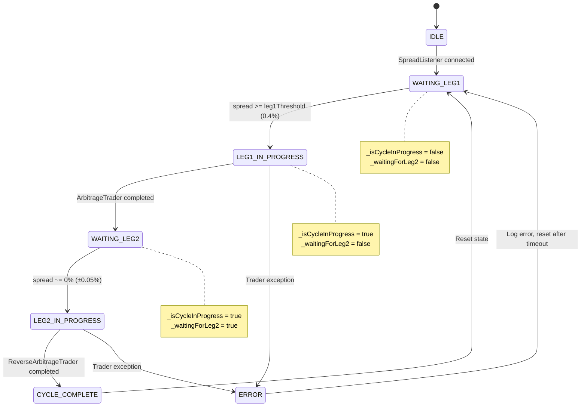
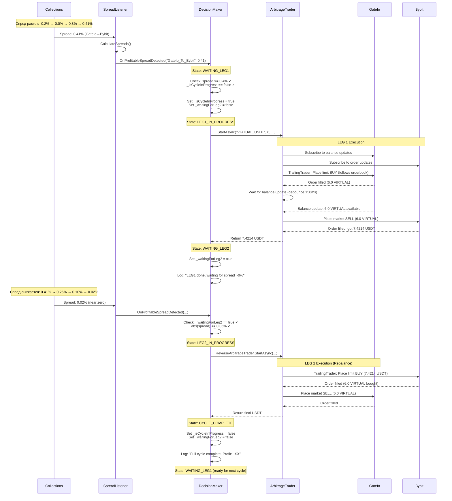
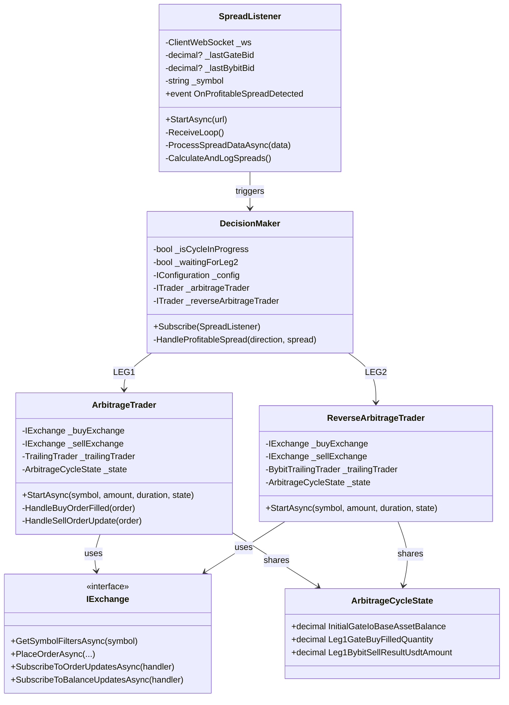
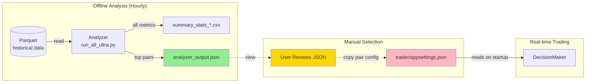

# План Интеграции Проектов arb1

**Дата:** 2025-11-10
**Статус:** Актуализировано после аудита
**Версия:** 2.0

---

## Текущее Состояние Проектов

### Collections (SpreadAggregator .NET)
**Роль:** Data Hub - сбор и трансляция market data

**Что работает:**
- ✅ Подключение к 8 биржам (Binance, Bybit, GateIo, OKX, Kucoin, Bitget, BingX, Mexc)
- ✅ Real-time получение bid/ask через WebSocket
- ✅ Сохранение в Parquet (data lake по пути `C:\visual projects\arb1\data\market_data`)
- ✅ FleckWebSocketServer на `ws://127.0.0.1:8181` для трансляции
- ✅ RollingWindowService (15-минутное скользящее окно)
- ✅ Dashboard (index.html) для визуализации графиков

**Что НЕ работает:**
- ❌ Нормализация символов несовместима с Trader (удаляет ВСЕ разделители: `VIRTUAL/USDT` → `VIRTUALUSDT`)
- ❌ Нет REST API для получения исторических данных
- ❌ Нет endpoint для списка активных символов

### Analyzer (Python)
**Роль:** Offline анализ исторических данных для поиска profitable пар

**Что работает:**
- ✅ Читает Parquet файлы напрямую из data lake
- ✅ Рассчитывает метрики (opportunity_cycles, zero_crossings, asymmetry)
- ✅ Выводит топ пары в console и CSV (`analyzer/summary_stats/`)
- ✅ Запускается вручную с CLI аргументами (--date, --start-date, --end-date)

**Что НЕ работает:**
- ❌ Не экспортирует результаты в формате для Trader
- ❌ Не работает как сервис (только ручной запуск)
- ❌ Нет автоматического обновления (планируется hourly cron)

### Trader (TraderBot .NET)
**Роль:** Execution engine - исполнение арбитражных циклов

**Что работает:**
- ✅ SpreadListener (WebSocket клиент для подключения к Collections)
- ✅ ArbitrageTrader (Gate BUY limit → Bybit SELL market)
- ✅ ReverseArbitrageTrader (Bybit BUY limit → Gate SELL market)
- ✅ TrailingTrader (следит за order book и двигает лимитный ордер)
- ✅ Стратегия: 2-leg rebalancing cycle (LEG1 при spread 0.4% → LEG2 при spread ~0%)

**Что НЕ работает:**
- ❌ SpreadListener НЕ СОВМЕСТИМ с Collections (ожидает `VIRTUAL_USDT`, получает `VIRTUALUSDT`)
- ❌ DecisionMaker не доделан (только логирует, не запускает трейдеры)
- ❌ Не читает результаты Analyzer (нет integration layer)
- ❌ Нет конфигурации "какие пары торговать"
- ❌ Нет выбора начальной биржи (Gate первым или Bybit первым)

---

## Архитектура Системы (Визуализация)

### 1. Общая Архитектура Компонентов



### 2. Поток Данных (Real-time)



### 3. DecisionMaker State Machine



### 4. Торговый Цикл (Детальная Последовательность)



### 5. Ключевые Классы и Зависимости



### 6. Analyzer → Trader Integration Flow



---

## Критичные Проблемы Интеграции

### 🔴 Проблема 1: Symbol Normalization (БЛОКЕР)

**Описание:**
Collections нормализует символы удаляя ВСЕ разделители, Trader ожидает формат с подчеркиванием.

**Локация:**
- Collections: `SpreadAggregator.Application/Services/OrchestrationService.cs:127`
- Trader: `TraderBot.Core/ArbitrageTrader.cs:44-45`

**Текущий код Collections:**
```csharp
var normalizedSymbol = spreadData.Symbol
    .Replace("/", "")
    .Replace("-", "")
    .Replace("_", "")
    .Replace(" ", "");
// VIRTUAL/USDT → VIRTUALUSDT
```

**Текущий код Trader:**
```csharp
_baseAsset = symbol.Split('_')[0];  // Ожидает VIRTUAL_USDT
_quoteAsset = symbol.Split('_')[1]; // Падает если нет '_'
```

**Решение:**
Изменить Collections нормализацию на:
```csharp
var normalizedSymbol = spreadData.Symbol
    .Replace("/", "_")
    .Replace("-", "_")
    .Replace(" ", "");
// VIRTUAL/USDT → VIRTUAL_USDT
// BTC-USDT → BTC_USDT
```

**Приоритет:** КРИТИЧНЫЙ
**Estimate:** 10 минут

---

### 🟡 Проблема 2: Отсутствие Analyzer → Trader Integration

**Описание:**
Analyzer выдает CSV, пользователь смотрит руками, вручную прописывает в Trader конфиг.

**Решение:**
Создать промежуточный формат данных.

**План:**
1. Analyzer экспортирует JSON: `analyzer/output/latest_opportunities.json`
2. Формат:
```json
{
  "timestamp": "2025-11-10T15:00:00Z",
  "pairs": [
    {
      "symbol": "VIRTUAL_USDT",
      "exchange1": "GateIo",
      "exchange2": "Bybit",
      "cycles_per_hour": 22.8,
      "asymmetry": 0.03,
      "recommended_threshold": 0.35
    }
  ]
}
```
3. Пользователь смотрит JSON, выбирает пару, прописывает в `trader/appsettings.json`

**Приоритет:** ВЫСОКИЙ
**Estimate:** 30 минут (Analyzer) + 20 минут (Trader config loader)

---

### 🟡 Проблема 3: DecisionMaker не доделан

**Описание:**
DecisionMaker только логирует события, не запускает трейдеры.

**Что нужно:**
1. Читать конфиг из `appsettings.json`:
   - Enabled symbol
   - Start exchange (GateIo или Bybit)
   - LEG1 threshold (например 0.4%)
   - LEG2 threshold (например 0.0%)
   - Trade amount (например 6)

2. Инициализировать трейдеры через DI в Program.cs:
   - GateIoExchange, BybitExchange
   - ArbitrageTrader, ReverseArbitrageTrader
   - ArbitrageCycleState

3. Логика в DecisionMaker:
```csharp
// LEG 1: Открытие позиции при достижении threshold
if (spread >= leg1Threshold && !_isCycleInProgress)
{
    _isCycleInProgress = true;
    if (startExchange == "GateIo")
        await _arbitrageTrader.StartAsync(...);
    else
        await _reverseArbitrageTrader.StartAsync(...);
    _waitingForLeg2 = true;
}

// LEG 2: Закрытие позиции при возврате к ~0%
if (_waitingForLeg2 && Math.Abs(spread) <= 0.05)
{
    if (startExchange == "GateIo")
        await _reverseArbitrageTrader.StartAsync(...);
    else
        await _arbitrageTrader.StartAsync(...);

    _isCycleInProgress = false;
    _waitingForLeg2 = false;
}
```

**Приоритет:** КРИТИЧНЫЙ
**Estimate:** 2 часа

---

## Минимальный Roadmap (Версия Для Быстрого Запуска)

### Фаза 0: Исправление Блокеров (2 часа)

#### ✅ Задача 0.1: Исправить Symbol Normalization в Collections
**Файл:** `collections/src/SpreadAggregator.Application/Services/OrchestrationService.cs:127`
**Изменение:** `.Replace("/", "_")` вместо `""`
**Тест:** Запустить Collections, подключиться через wscat, проверить формат Symbol в сообщениях
**Estimate:** 10 минут

#### ✅ Задача 0.2: Протестировать SpreadListener
**Действия:**
1. Запустить Collections: `cd collections/src/SpreadAggregator.Presentation && dotnet run`
2. Запустить Trader: `cd trader/src/Host && dotnet run`
3. Проверить логи: должны появляться сообщения о получении spread'ов
4. Если ошибки - исправить десериализацию

**Estimate:** 30 минут

#### ✅ Задача 0.3: Добавить TradeConfig в appsettings.json
**Файл:** `trader/src/Host/appsettings.json`
**Добавить:**
```json
{
  "TradingConfig": {
    "Symbol": "VIRTUAL_USDT",
    "StartExchange": "GateIo",
    "Leg1Threshold": 0.4,
    "Leg2Threshold": 0.0,
    "Amount": 6
  }
}
```
**Estimate:** 5 минут

---

### Фаза 1: Базовая Интеграция (3 часа)

#### ✅ Задача 1.1: Инициализация Exchanges и Traders в Program.cs
**Файл:** `trader/src/Host/Program.cs`
**Добавить:**
- Создание GateIoExchange, BybitExchange из appsettings.json
- Создание ArbitrageCycleState
- Создание ArbitrageTrader, ReverseArbitrageTrader
- Передача в DecisionMaker через constructor DI

**Estimate:** 1 час

#### ✅ Задача 1.2: Доделать DecisionMaker
**Файл:** `trader/src/Core/DecisionMaker.cs`
**Добавить:**
- Constructor: принимать IConfiguration, ITrader arbTrader, ITrader revArbTrader
- Читать TradingConfig из конфига
- Реализовать логику LEG1 / LEG2 (см. выше)
- Логирование текущего состояния цикла

**Estimate:** 2 часа

---

### Фаза 2: Analyzer Integration (1 час)

#### ✅ Задача 2.1: Экспорт JSON из Analyzer
**Файл:** `analyzer/run_all_ultra.py` (в конце скрипта)
**Добавить:**
```python
# После сохранения CSV
top_pairs = df[df['cycles_040bp_per_hour'] > 5].head(10)
output = {
    "timestamp": datetime.now().isoformat(),
    "pairs": [
        {
            "symbol": row['symbol'].replace("#", "_"),  # Нормализация
            "exchange1": row['exchange1'],
            "exchange2": row['exchange2'],
            "cycles_per_hour": float(row['cycles_040bp_per_hour']),
            "asymmetry": float(row['deviation_asymmetry'])
        }
        for _, row in top_pairs.iterrows()
    ]
}

output_path = Path('../trader/analyzer_output.json')
with open(output_path, 'w') as f:
    json.dump(output, f, indent=2)

print(f"\nAnalyzer output saved to: {output_path}")
```
**Estimate:** 30 минут

#### ✅ Задача 2.2: Документация для пользователя
**Создать:** `docs/user_workflow.md`
**Описать:**
1. Как запустить Analyzer (`python run_all_ultra.py --date 2025-11-10`)
2. Где посмотреть результаты (`analyzer_output.json`)
3. Как выбрать пару (критерии: cycles > 10, asymmetry < 0.3)
4. Как прописать в `trader/appsettings.json`
5. Как запустить Collections + Trader

**Estimate:** 30 минут

---

## Итоговый Timeline

| Фаза | Задачи | Estimate | Priority |
|------|--------|----------|----------|
| **Фаза 0** | Исправление блокеров | 45 мин | КРИТИЧНАЯ |
| **Фаза 1** | Базовая интеграция | 3 часа | КРИТИЧНАЯ |
| **Фаза 2** | Analyzer integration | 1 час | ВЫСОКАЯ |
| **ИТОГО** | Минимум для работы | **~5 часов** | |

---

## User Workflow (После Завершения)

**1. Запуск Analyzer (каждый час):**
```bash
cd analyzer
python run_all_ultra.py --date 2025-11-10
# Смотрите analyzer_output.json
```

**2. Выбор пары и настройка Trader:**
```bash
# Открыть trader/src/Host/appsettings.json
# Прописать:
# - Symbol: "VIRTUAL_USDT"
# - StartExchange: "GateIo" или "Bybit"
# - Thresholds
```

**3. Запуск Collections (работает 24/7):**
```bash
cd collections/src/SpreadAggregator.Presentation
dotnet run
```

**4. Запуск Trader:**
```bash
cd trader/src/Host
dotnet run
```

**5. Мониторинг:**
- Логи Trader: `trader/logs/`
- Dashboard: `http://localhost:5000`

---

## Долгосрочный Roadmap (После MVP)

### Фаза 3: REST API в Collections
- `GET /api/symbols` - список активных символов
- `GET /api/historical/{symbol}/{exchange1}/{exchange2}` - исторические данные
- Swagger документация

### Фаза 4: Dynamic Thresholds
- DecisionMaker запрашивает статистику окна у Collections
- Использует quantiles (97th, 3rd) как dynamic thresholds вместо fixed 0.4%

### Фаза 5: Trading Dashboard
- Real-time статус торговли (LEG1/LEG2)
- P&L tracking
- Кнопки Enable/Disable пар из UI

### Фаза 6: Orchestration
- Systemd services / Windows Services для auto-start
- Health checks и auto-restart
- Metrics (Prometheus) и alerting

---

## Риски и Mitigation

| Риск | Mitigation |
|------|-----------|
| Collections не стартует | Добавить health check endpoint, логирование startup |
| WebSocket обрывается | Reconnection logic в SpreadListener |
| Trader падает при ошибке ордера | Try-catch + retry logic в трейдерах |
| Analyzer данные устаревают | Hourly cron, timestamp validation |
| Несовместимость моделей данных | JSON schema validation, integration tests |

---

## Acceptance Criteria (MVP Ready)

- [ ] Collections запускается и транслирует spreads на ws://127.0.0.1:8181
- [ ] Trader SpreadListener получает spreads без ошибок десериализации
- [ ] Analyzer экспортирует `analyzer_output.json` с топ парами
- [ ] Пользователь может выбрать пару и прописать в `trader/appsettings.json`
- [ ] DecisionMaker запускает ArbitrageTrader при LEG1 threshold
- [ ] DecisionMaker запускает ReverseArbitrageTrader при LEG2 threshold
- [ ] Полный цикл LEG1 → LEG2 завершается успешно
- [ ] Логи содержат latencies, балансы, profit

---

**Следующий шаг:** Начать с Фазы 0 - исправление Symbol Normalization
