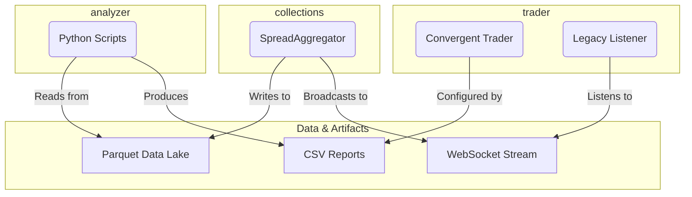

# System Dependencies Map
**Version:** 1.0 (Created on 2025-11-18)

This document outlines the dependencies between the three main projects: `collections`, `trader`, and `analyzer`. For definitions of key terms, see the [Glossary](glossary.md).

## 1. `trader` Dependencies

The `trader` project has conditional dependencies based on its mode of operation.

### Dependency on `collections`
*   **Type:** Real-time, Runtime Dependency
*   **Mode:** Passive/Legacy Mode only
*   **Description:** When the `trader` is run in its default legacy mode, it establishes a WebSocket connection to the server hosted by the `collections` project to receive a stream of spread data.
*   **Status:** **DEPRECATED.** The legacy mode is removed from the main execution path. The active `ConvergentTrader` mode has **no dependency** on `collections`.

### Dependency on `analyzer`
*   **Type:** Indirect, Human-Mediated Data Dependency
*   **Description:** There is no direct technical dependency. The CSV reports generated by the `analyzer` are used by a human operator to determine the strategy and configuration (e.g., which symbols to trade) for the `trader`'s active `ConvergentTrader` mode.

## 2. `analyzer` Dependencies

### Dependency on `collections`
*   **Type:** Asynchronous, Data Dependency
*   **Description:** The `analyzer` reads the historical market data (in Parquet format) that is written to the data lake by the `collections` project. This is an offline process; the `analyzer` does not interact with the `collections` application directly.

## 3. `collections` Dependencies

The `collections` project has **no dependencies** on the other two projects. It is the foundational data source for the entire system.

## Summary Table

| Source Project | Dependency Type | Target Project | Description |
| :--- | :--- | :--- | :--- |
| `trader` (Legacy Mode) | Real-time | `collections` | Consumes WebSocket stream of spread data. |
| `analyzer` | Data | `collections` | Consumes historical Parquet files from the data lake. |
| `analyzer` | Indirect (Human) | `trader` | Produces reports that inform the `trader`'s configuration. |
| `collections` | None | N/A | Is the source of data and has no incoming dependencies. |
