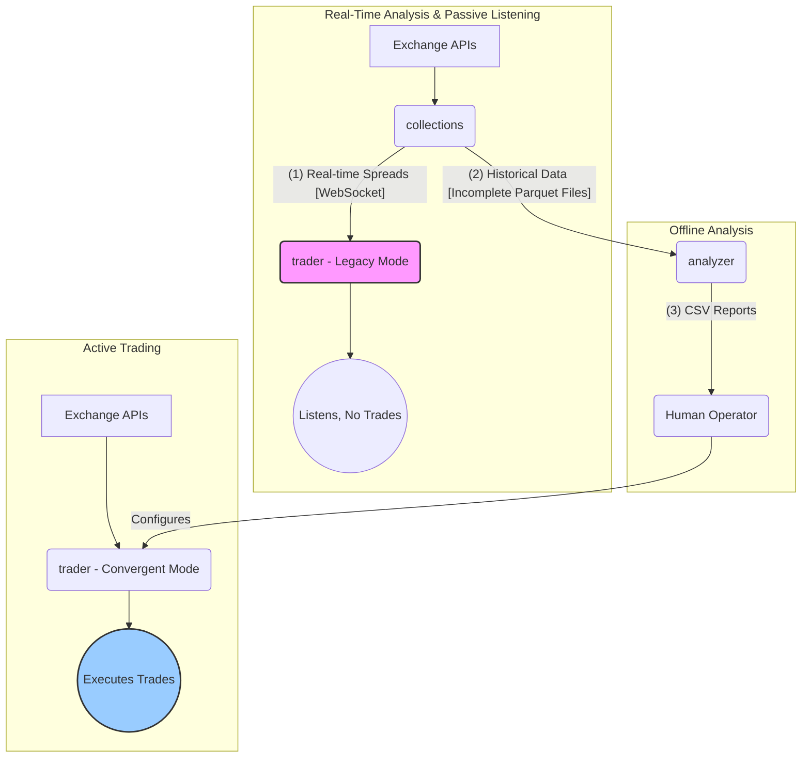

# High-Level System Architecture
**Version:** 3.0 (Validated on 2025-11-18)

This system is designed for cryptocurrency market analysis and automated trading. It consists of three primary, decoupled components: `collections`, `trader`, and `analyzer`. Each component has a distinct role and interacts with the others through well-defined data handoffs.

## 1. Components

### 1.1. `collections` (The Data Hub)

*   **Project:** `SpreadAggregator` (C#)
*   **Role:** The central nervous system for data. It is responsible for acquiring, processing, and distributing all market data.
*   **Key Responsibilities:**
    *   **Data Ingestion:** Establishes real-time WebSocket connections to multiple exchanges (e.g., Binance, Bybit, Gate.io) to subscribe to price and trade streams.
    *   **Real-time Broadcasting:** Calculates arbitrage spreads and streams this data via a WebSocket server (`ws://localhost:5000/ws/realtime_charts`). This serves as a data source for other components.
    *   **Historical Persistence:** Asynchronously writes raw market data to a data lake (`/data/market_data`) in Parquet format. This data is intended for offline analysis.
*   **Architectural Note:** The project contains a known "competing consumers" flaw, which results in the persisted Parquet files being incomplete.

### 1.2. `trader` (The Execution Engine)

*   **Project:** `TraderBot` (C#)
*   **Role:** Responsible for executing trading strategies. It operates in one of two distinct modes, determined at startup.
*   **Modes of Operation:**
    1.  **Convergent Trader Mode (Active):**
        *   **Trigger:** Activated by passing an exchange name (`bybit` or `gate`) as a command-line argument.
        *   **Functionality:** This is the **primary, operational trading strategy**. It executes a simple, self-contained "buy-then-sell" strategy on a single exchange.
        *   **Dependencies:** This mode is **self-contained**. It connects directly to the target exchange and **does not consume any data from the `collections` project.**
    2.  **Spread Listener Mode (Legacy/Passive):**
        *   **Trigger:** The default mode when the application is started with no arguments.
        *   **Functionality:** Connects to the `collections` WebSocket server to listen for profitable spread opportunities. However, the `DecisionMaker` component that receives these signals is a **non-functional placeholder**.
        *   **Conclusion:** In this mode, the `trader` **listens but does not execute any trades.**

### 1.3. `analyzer` (The Offline Brain)

*   **Project:** Python scripts (`run_all_ultra.py`)
*   **Role:** Performs offline, batch analysis of historical data to find statistical patterns.
*   **Key Responsibilities:**
    *   **Data Reading:** Processes the (incomplete) Parquet files from the data lake generated by `collections`.
    *   **High-Performance Analysis:** Uses `polars` and `multiprocessing` to run high-speed parallel analysis on the historical data.
    *   **Reporting:** Generates CSV reports that rank trading pairs by their statistical arbitrage potential. These reports are used to inform which symbols and parameters to use with the `trader`.

## 2. Data Flows and Dependencies

The system has two main data flows that correspond to its real-time and analytical functions.

1.  **Real-Time Passive Flow (`collections` -> `trader` Legacy Mode):** `collections` streams calculated spreads. The `trader`'s legacy mode can connect to this stream to listen, but it does not act on the data.
2.  **Historical/Batch Flow (`collections` -> `analyzer`):** `collections` persists historical data to disk. `analyzer` periodically reads this data for deep statistical analysis.
3.  **Strategic Flow (`analyzer` -> Human -> `trader` Active Mode):** The output from `analyzer` (CSV reports) is consumed by a human operator, who uses the insights to configure and run the active `ConvergentTrader` mode of the `trader` project. Note the clear separation: the active trading loop is independent of the `collections` project.
