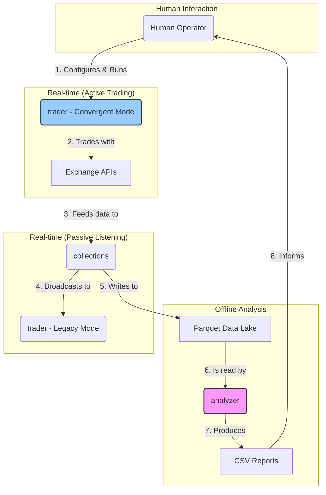

# Overall System Process Flows
**Version:** 3.0 (Validated on 2025-11-18)

This document describes the end-to-end process and data flows between the three main system components: `collections`, `analyzer`, and `trader`. The system has three distinct flows.

## 1. Active Trading Flow (Convergent Trader)

This is the primary, operational flow where trades are executed. This flow is self-contained within the `trader` project and does not depend on the other components in real-time.

1.  **Human Input:** A human operator, using insights from the "Offline Analysis Flow," configures the `trader`'s `appsettings.json` with a target exchange, symbol, and trading amount.
2.  **Initiation:** The operator starts the `trader` application with a command-line argument (e.g., `dotnet run bybit`).
3.  **Execution:** The `trader`'s `ConvergentTrader` mode activates. It connects directly to the specified exchange's API.
4.  **Trading Cycle:** The `ConvergentTrader` executes its buy-then-sell strategy on the single exchange.
5.  **Logging:** The trader logs its activity to `logs/log.txt`. There is currently no automated feedback loop from this process.

## 2. Passive Listening Flow (Legacy)

This flow describes the original real-time connection between `collections` and `trader`. It is a passive, data-monitoring-only process.

1.  **Data Ingestion:** `collections` connects to the WebSocket streams of multiple exchanges.
2.  **Spread Calculation:** `collections` continuously calculates arbitrage spreads between exchanges.
3.  **Spread Broadcasting:** `collections` broadcasts each calculated spread via its own WebSocket server.
4.  **Signal Reception:** The `trader` project, when run in its default (no-argument) legacy mode, connects to the `collections` WebSocket server and receives the stream of spread data.
5.  **Process Halts:** The `trader`'s `DecisionMaker` component logs the opportunity and then stops. **No trade is executed.**

## 3. Offline Analysis Flow

This flow is designed for offline analysis to find and validate trading strategies, which then informs the "Active Trading Flow".

1.  **Data Persistence:** While running, `collections` saves all raw market data it receives into a data lake of Parquet files.
    *   **Note:** Due to a known architectural flaw ("competing consumers"), this data is incomplete.
2.  **Batch Analysis:** A human operator runs the `analyzer` Python script, pointing it at the data lake.
3.  **Parallel Processing:** `analyzer` uses `multiprocessing` to perform high-speed analysis on the historical data, calculating statistical metrics.
4.  **Report Generation:** `analyzer` produces a CSV report that ranks trading pairs based on their historical arbitrage potential.
5.  **Human Decision:** The operator uses this report to inform the configuration for the "Active Trading Flow".

## Summary Diagram

1.  **Active Trading:** A `Human Operator` configures and runs the `trader` in `Convergent Mode`, which interacts directly with `Exchange APIs`.
2.  **Passive Listening & Data Collection:** `Exchange APIs` feed data into `collections`. It broadcasts real-time data to the `trader`'s `Legacy Mode` (which takes no action) and simultaneously writes historical data to the `Parquet Data Lake`.
3.  **Offline Analysis:** The `analyzer` reads from the `Parquet Data Lake`, produces `CSV Reports`, which are then used by the `Human Operator` to inform future trading decisions, thus completing the loop.