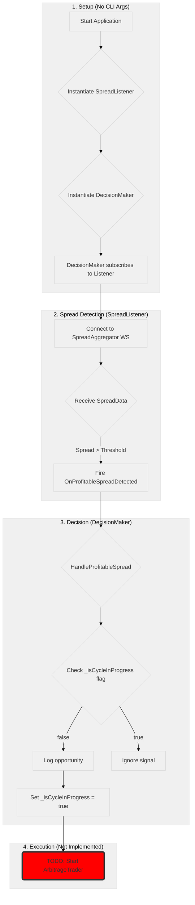

# Trader Project: Detailed Process Flow
**Version:** 4.0 (Validated on 2025-11-18)

This document describes the detailed, step-by-step data and execution flow of the `Trader` application. It covers both the **Legacy Two-Legged Arbitrage MVP Process Flow** and the **Current Convergent Trader MVP Process Flow**.

## 1. Current Process Flow (Convergent Trader MVP)

This section details the currently active and operational process flow within the `Trader` application, driven by the `ConvergentTrader`. This is a simplified, single-exchange trading strategy.

### Diagram

```mermaid
%%{init: {'theme': 'base', 'themeVariables': { 'primaryColor': '#f0f0f0', 'edgeLabelBackground':'#f0f0f0', 'clusterBkg': '#f0f0f0'}}}%%
graph TD
    subgraph "1. Startup"
        A[Start with 'bybit' or 'gate' arg] --> B{RunManualConvergentTrader};
        B --> C[Instantiate IExchange];
        C --> D[Instantiate ConvergentTrader];
    end

    subgraph "2. Trading Cycle (ConvergentTrader)"
        D --> E{StartAsync};
        E --> F[Cancel Open Orders];
        F --> G[Start TrailingTrader for BUY];
        G --> H{OnOrderFilled (BUY)};
        H --> I[Wait for Balance Update];
        I --> J[Wait 5 seconds];
        J --> K[Place Market SELL Order];
        K --> L{Assume Sell Fill};
        L --> M[Cycle Complete];
    end

    style G fill:#cde,stroke:#333,stroke-width:2px
    style K fill:#f99,stroke:#333,stroke-width:2px
```

### Step 1: Application Startup ([`Program.cs:18`](trader/src/Host/Program.cs:18))

1.  **Configuration:** The application loads its settings from `appsettings.json`, including API keys, trading parameters (symbol, quantity, sell delay), and exchange-specific configurations.
2.  **Exchange Initialization:** An instance of the chosen `IExchange` implementation (e.g., `BybitExchange`) is created based on configuration.
3.  **`ConvergentTrader` Initialization:** A `ConvergentTrader` instance is created, injected with the initialized `IExchange` and trading parameters.
4.  **Execution:** The `Program.cs` now directly calls a method like `RunManualConvergentTrader()` which orchestrates the `ConvergentTrader`'s execution loop.

### Step 2: Trading Cycle ([`ConvergentTrader.cs`](trader/src/Core/ConvergentTrader.cs))

The `ConvergentTrader` manages a complete buy-then-sell cycle on a single exchange.

1.  **Initialize & Cancel Orders** ([`ConvergentTrader.cs:48`](trader/src/Core/ConvergentTrader.cs:48)):
    *   Upon startup, the `ConvergentTrader` cancels all existing open orders for the specified symbol to ensure a clean state.
2.  **Initiate Trailing Buy** ([`ConvergentTrader.cs:59`](trader/src/Core/ConvergentTrader.cs:59)):
    *   The `ConvergentTrader` delegates the initial buy order placement to an internal `TrailingTrader`. This means the buy order will dynamically chase the market price to get an optimal entry.
3.  **Handle Buy Fill** ([`ConvergentTrader.cs:64`](trader/src/Core/ConvergentTrader.cs:64)):
    *   Upon receiving confirmation that the buy order has been filled, the `ConvergentTrader` records the exact purchased quantity and the average entry price.
4.  **Wait for Balance Update and Confirmation** ([`ConvergentTrader.cs:73`](trader/src/Core/ConvergentTrader.cs:73)):
    *   Crucially, after a buy fill, the system explicitly waits for a balance update to confirm the acquired asset is available. It uses a `TaskCompletionSource` (`_baseAssetBalanceTcs`) and a debounce timer (150ms) for robustness.
5.  **Fixed Delay Before Sell** ([`ConvergentTrader.cs:81`](trader/src/Core/ConvergentTrader.cs:81)):
    *   After balance confirmation, the system waits for a precise **5 seconds** (`Task.Delay(5000);`) before proceeding to the sell phase.
6.  **Initiate Market Sell** ([`ConvergentTrader.cs:116`](trader/src/Core/ConvergentTrader.cs:116)):
    *   After the delay, the `ConvergentTrader` places a market sell order for the *entire confirmed available quantity* on the *same exchange*.
7.  **Assume Sell Fill & Estimate Proceeds:**
    *   The current implementation includes a `Task.Delay(1000);` after placing the market sell, *assuming* the market sell fills almost immediately.
    *   A rough estimate of the proceeds is calculated internally.
8.  **Loop or Stop:**
    *   The `ConvergentTrader` completes its cycle and the application terminates.

---

## 2. Legacy Process Flow (Deprecated MVP)

This section outlines the intended (but not fully realized) process flow for the initial two-legged arbitrage strategy. While the code components still exist, this flow is **no longer active** in the `Trader` application.

### Diagram



### Step 1: Application Startup ([`Program.cs:36`](trader/src/Host/Program.cs:36))

1.  **Conditional Execution:** In scenarios where the `ConvergentTrader` is not explicitly invoked via command-line arguments, `Program.cs` simply displays usage instructions.
2.  **Legacy Code Status:** The `SpreadListener` and `DecisionMaker` instantiation code has been **removed** from `Program.cs` to prevent accidental execution of the deprecated logic. The classes still exist in the `Core` namespace for reference but are not wired up.

### Step 2: Spread Detection ([`SpreadListener.cs`](trader/src/Core/SpreadListener.cs))

1.  **Connection:** `SpreadListener` establishes a WebSocket connection to the `SpreadAggregator` (`Collections` project).
2.  **Event Trigger:** If a spread exceeds a predefined threshold, `SpreadListener` fires the `OnProfitableSpreadDetected` event.
    *   **Stale Data Check:** Before firing, it checks if the price data from *both* exchanges is younger than **7 seconds**. If either is stale, the event is suppressed.
    *   **Connection Check:** Explicitly verifies `WebSocketState.Open` before processing.

### Step 3: Trade Initiation ([`DecisionMaker.cs`](trader/src/Core/DecisionMaker.cs))

1.  **Event Handling:** The `DecisionMaker`'s `HandleProfitableSpread` method is triggered by the event.
2.  **Process Halts (Legacy):** The `DecisionMaker` logs that a profitable spread was detected. **This component performs no trading actions.** The code to start a trade is a `//TODO` placeholder.
