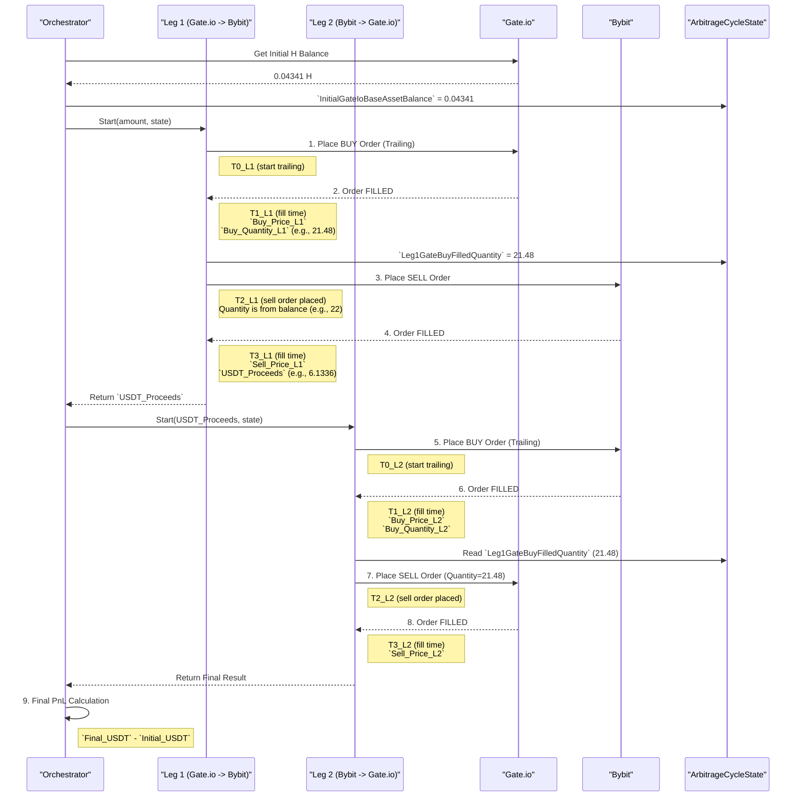

# **УСТАРЕВШИЙ ДОКУМЕНТ**

**ВНИМАНИЕ:** Этот документ и диаграмма описывают сбор метрик для устаревшей логики двухэтапного арбитража (`two-legged arbitrage`), которая больше не используется в проекте.

Актуальное и корректное описание текущих метрик находится в файле [**metrics.md**](./metrics.md).

---

# Диаграмма последовательности: Сбор метрик в полном цикле

Эта диаграмма показывает, в какие моменты времени в рамках полного двухлегового арбитражного цикла собираются ключевые метрики.

### Ключевые метрики и их сбор

-   **`Leg1_Gate_Buy_Quantity`**: `Leg1GateBuyFilledQuantity`
    -   **Источник:** Прямо из исполненного ордера на покупку на Gate.io.
    -   **Назначение:** Сохраняется в `ArbitrageCycleState` и является **ключевым значением** для ордера на продажу в `Leg 2`.

-   **`Leg1_Bybit_Sell_Quantity`**:
    -   **Источник:** Из события обновления баланса на Gate.io (менее надежно).
    -   **Проблема:** Может включать "пыль" и не совпадать с `Leg1_Gate_Buy_Quantity`.

-   **`Leg2_Gate_Sell_Quantity`**:
    -   **Источник:** `ArbitrageCycleState.Leg1GateBuyFilledQuantity`.
    -   **Результат:** Гарантирует, что в конце цикла продается ровно столько же, сколько было куплено в начале.

-   **Сквозная задержка (End-to-End Latency):**
    -   **Leg 1:** `T3_L1 - T1_L1` (от фиксации покупки на Gate.io до фиксации продажи на Bybit).
    -   **Leg 2:** `T3_L2 - T1_L2` (от фиксации покупки на Bybit до фиксации продажи на Gate.io).