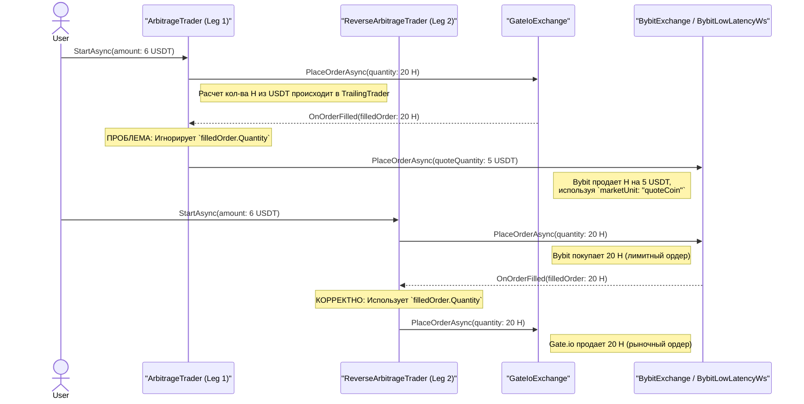

# Анализ потока данных о количестве (Quantity Flow)

Эта диаграмма иллюстрирует, как и в каких единицах измерения (`Base` - базовая валюта, `Quote` - котируемая) передается количество на каждом этапе арбитражного цикла для обоих "ног".

## Диаграмма

## Выводы

1.  **Несоответствие в Leg 1:** `ArbitrageTrader` работает некорректно. Он покупает определенное количество **базового актива** на Gate.io, но затем продает на Bybit фиксированное количество **котируемого актива** (`5 USDT`), полностью игнорируя результат первой части сделки. Это главная причина расхождений и потенциальных убытков.
2.  **Корректная работа Leg 2:** `ReverseArbitrageTrader` реализует правильную логику. Он берет точное количество исполненного **базового актива** с Bybit и передает его для продажи на Gate.io.
3.  **Проблема `BALANCE_NOT_ENOUGH`:** Ошибка `BALANCE_NOT_ENOUGH` на Gate.io в `Leg 2` возникает не из-за неправильной логики, а потому что для продажи **базового актива** (`H`) он должен физически присутствовать на счете Gate.io в момент сделки.

**Рекомендация:**
Необходимо исправить `ArbitrageTrader` (Leg 1), чтобы он использовал ту же логику, что и `ReverseArbitrageTrader` (Leg 2): брать `filledOrder.Quantity` из первой ноги и использовать его для продажи во второй. Также необходимо унифицировать вызовы `PlaceOrderAsync` во всей системе, чтобы они всегда оперировали количеством в **базовой валюте**.